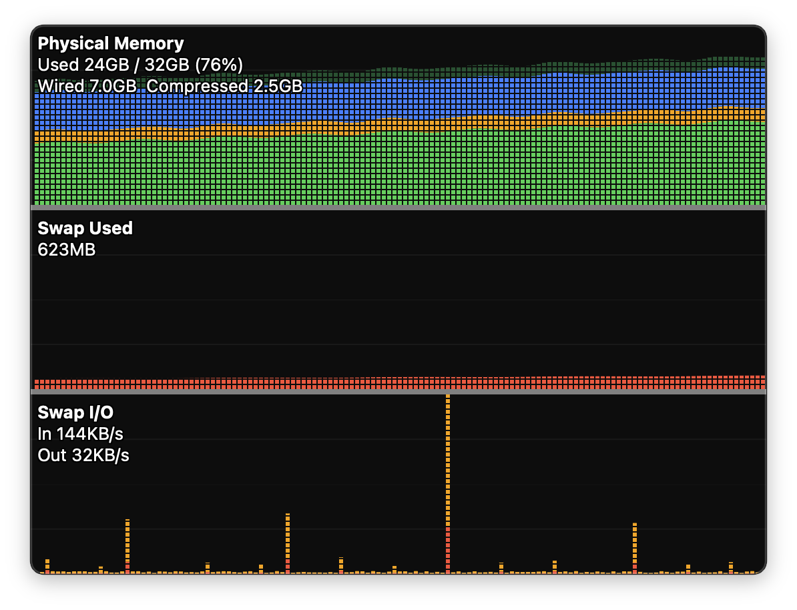

# MemMind

macOS のメモリ使用状況をリアルタイムで確認できる、常駐型の履歴グラフアプリです。  
アクティビティモニタの CPU 履歴と同じスタイルで、物理メモリ・スワップ・I/O の推移を表示します。

A lightweight macOS app that shows real-time memory usage history in the style of Activity Monitor's CPU history. Displays physical memory breakdown, swap usage, and swap I/O over time.

## スクリーンショット



## ダウンロード

最新バージョンは[リリースページ](../../releases/latest)からダウンロードできます。

## 国際化

日本語・英語に対応しています。macOS のシステム言語設定に応じて自動的に切り替わります。

## 技術情報

**使用技術**
- Swift / SwiftUI (macOS 14+)
- Darwin Mach API (`host_statistics64`) — カーネル直接アクセスでメモリ情報を取得
- `sysctlbyname("vm.swapusage")` — スワップ情報

**ビルド方法**

Xcode の場合：`MemMind.xcodeproj` を開き、スキーム `MemMind` を選択して実行。

コマンドラインの場合：
```bash
xcodebuild -project MemMind.xcodeproj -scheme MemMind -configuration Release build
```

**アイコン生成**

`generate_icon.swift` を実行すると全サイズの PNG が生成されます。
```bash
swift generate_icon.swift <出力ディレクトリ>
```
